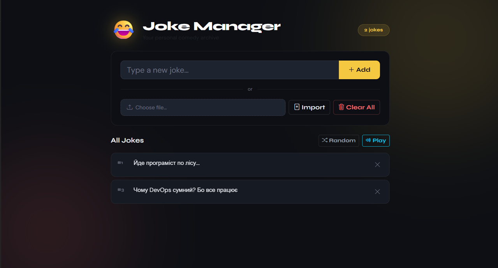

# Joke API — Home Assistant Add-on

A Home Assistant add-on that serves random Ukrainian jokes with a web UI, SQLite storage, and Text-to-Speech audio playback.  
Built with **Java 25 + Spring Boot 3**, packaged as a Docker container.

---


## Features

- Web UI to browse, add, delete, and import jokes
- Random joke endpoint with Ukrainian TTS audio generation
- SQLite database with auto-seeding from a bundled joke list
- Home Assistant ingress support (no extra port exposure needed)

---

## Installation as Home Assistant Add-on

1. In HA, go to **Settings → Add-ons → Add-on Store**
2. Click the 3-dot menu (top right) → **Repositories**
3. Add: `https://github.com/Mishann/joke-addon-repo`
4. Find **Joke API** in the store and click **Install**
5. Start the add-on — the web UI will appear in the HA sidebar

---

## Home Assistant Automation

To play a daily joke on a Google Cast device, add the following to your HA config.

**`configuration.yaml`:**
```yaml
rest_command: !include rest_commands.yaml
```

**`rest_commands.yaml`** (place in `/config/`):
```yaml
get_joke_audio:
  url: "http://joke_api:8080/api/joke/audio"
  method: GET
```

**`automations.yaml`** — append (example):
```yaml
alias: Ранковий анекдот
description: ""
triggers:
  - trigger: time
    at: "09:13:00"
conditions: []
actions:
  - action: rest_command.get_joke_audio
    response_variable: audio_response
  - action: tts.speak
    metadata: {}
    data:
      cache: false
      media_player_entity_id: media_player.nest_mini
      message: "Слухай анекдот:"
      language: uk
    target:
      entity_id: tts.google_en_com
  - delay: "00:00:02"
  - action: media_player.play_media
    target:
      entity_id: media_player.nest_mini
    data:
      media:
        media_content_id: http://192.168.0.173:8091/{{audio_response.content.url}}
        media_content_type: music
        metadata: {}
mode: single
```

---

## Run Locally

### Requirements

| Tool   | Version |
|--------|---------|
| JDK    | 25      |
| Maven  | 3.9+    |
| Docker | any     |

### With Maven

```bash
cd joke-api-java
mvn package -DskipTests
java -jar target/joke-api-1.0.0.jar
```

Open **http://localhost:8080** in your browser.

### With Docker

```bash
cd joke-api-java
docker build -t joke-api .
docker run -p 8080:8080 joke-api
```

## API Reference

| Method   | Path                  | Description                                          |
|----------|-----------------------|------------------------------------------------------|
| `GET`    | `/api/joke`           | Random joke `{"joke":"..."}`                         |
| `GET`    | `/api/joke/audio`     | Generate TTS mp3, returns `{"url":"api/audio/<id>.mp3"}` |
| `GET`    | `/api/audio/{file}`   | Stream the mp3 file                                  |
| `GET`    | `/api/all`            | All jokes as JSON array                              |
| `POST`   | `/api/joke`           | Add a joke (form field: `text`)                      |
| `DELETE` | `/api/joke/{id}`      | Delete joke by ID                                    |
| `DELETE` | `/api/clear`          | Delete all jokes                                     |
| `POST`   | `/api/import`         | Bulk import from `.txt` file (one joke per line)     |

---

## Project Structure

```
joke-addon-repo/
├── repository.yaml               # HA add-on repository manifest
├── joke-api-java/
│   ├── config.yaml               # HA add-on metadata
│   ├── Dockerfile                # Multi-stage Maven → JRE build
│   ├── pom.xml
│   └── src/main/
│       ├── java/com/jokeapi/
│       │   ├── JokeApiApplication.java
│       │   ├── controller/JokeController.java
│       │   ├── model/Joke.java
│       │   ├── repository/JokeRepository.java
│       │   └── service/JokeService.java
│       └── resources/
│           ├── application.yml
│           ├── jokes.txt          # Seed data
│           └── static/            # Web UI
│               ├── index.html
│               ├── app.js
│               └── style.css
```

---

## Notes

- TTS uses the Google Translate TTS endpoint (same as `gTTS`), language hardcoded to **Ukrainian**
- Audio files are cleared before each new generation to avoid accumulation
- The `/data` volume is persistent across add-on restarts

